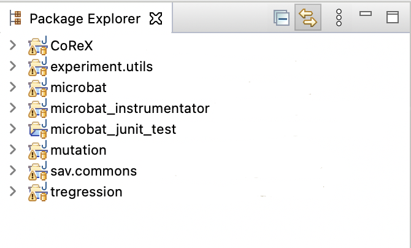

# CoReX: A Context-Aware Refinement-Bases Slicing Technique for Regression Debugging

This repository hosts CoReX, a regression analysis approach based on program slicing. 
Given a test failure and two versions of a program and a test passing on one and failing on the other version of the program, 
CoReX automatically generates a summarized version of the slices produced by the dual slicing technique. 

---
---

## Requirements

* Running platform: Linux or MacOS

* Java Runtime Environment version: 8

* Eclipse version: 4.16

---
---

### Building CoReX on your machine

CoReX builts on InPreSS (https://github.com/resess/InPreSS) which itself relies 
on the TRegression (ERASE) (https://github.com/llmhyy/tregression) for aligning the two traces and 
Slicer4J (https://github.com/resess/Slicer4J) for computing control and data-flow dependencies. 

1. Start with cloning the repository:
````yaml
git clone https://github.com/anonymousResearcher24/CoReX.git
````
In this repo, we provide:
- microbat: including all microbat subprojects that are required for TRegression
- tregression
- CoReX

Note that CoReX, Microbat, and TRegression projects are Eclipse plugin project. 

2. You need to import the following projects through "Existing Projects into Workspace":



- CoReX
- mirobat/experiment.utils
- microbat/mirobat
- mirobat/microbat_instrumentator
- mirobat/microbat_junit_test
- mirobat/mutation
- mirobat/sav.commons
- tregression/tregression

---
--- 

## Running the Tool Manually Through the Plugin 
### General guideline: Running with Main() method in Run
Now, you can run CoReX through the main method in the run class (run as "Java Application").

The main method takes as input following four arguments: 
- the path to the base folder, including two versions (See below for InPreSS and Defects4J subjects). 
- The benchmark name to run: InPreSS, Math, Closure, ....
- The bug_id
- The failing test

Here is an example of the structure of the bug repositories:


---

### Running on InPreSS subjects (LibRench)
The client and library projects are provided in a Zenodo zip file (https://zenodo.org/record/7683853/files/InPreSSBench.zip?download=1).

The structure of the folder is as follows:

|__ InPreSS<br />
&nbsp;&nbsp;&nbsp;&nbsp;&nbsp;&nbsp;|__ 1 <br />
&nbsp;&nbsp;&nbsp;&nbsp;&nbsp;&nbsp;|__ 2 <br /> 
&nbsp;&nbsp;&nbsp;&nbsp;&nbsp;&nbsp;|__ ...<br />

---

### Running on Defects4J
You can download the ready-to-use Defects4J benchmarks from zenodo: https://zenodo.org/record/7683853#.Y_3L1y-975g.
You can also follow the instructions in https://github.com/llmhyy/tregression to create the Defects4J Benchmarks: 
The structure of Defects4J is as follows:

|__ Math<br />
&nbsp;&nbsp;&nbsp;&nbsp;&nbsp;&nbsp;|__ 1 (bug_id)<br />
&nbsp;&nbsp;&nbsp;&nbsp;&nbsp;&nbsp;|__ 2 (bug_id)<br />
&nbsp;&nbsp;&nbsp;&nbsp;&nbsp;&nbsp;|__ ...<br />
|__ Closure<br />
&nbsp;&nbsp;&nbsp;&nbsp;&nbsp;&nbsp;|__ 1 (bug_id)<br />
&nbsp;&nbsp;&nbsp;&nbsp;&nbsp;&nbsp;|__ 2 (bug_id)<br />
&nbsp;&nbsp;&nbsp;&nbsp;&nbsp;&nbsp;|__ ...<br />

You can run each bugs similar to running our subjects. 